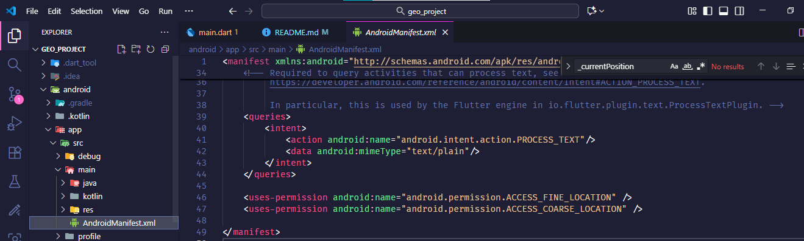
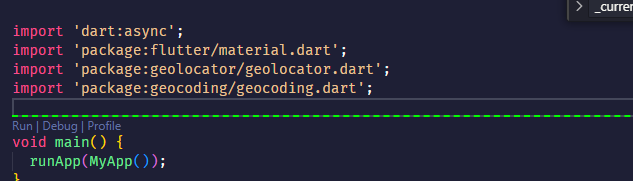
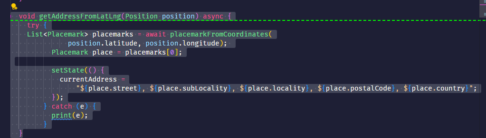
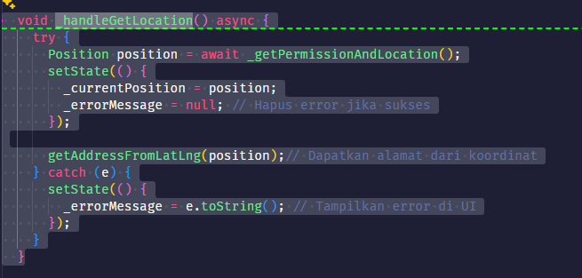
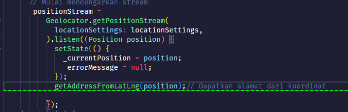
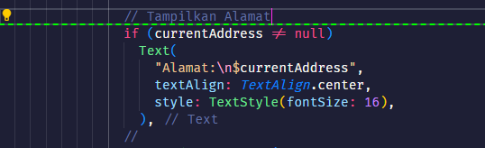
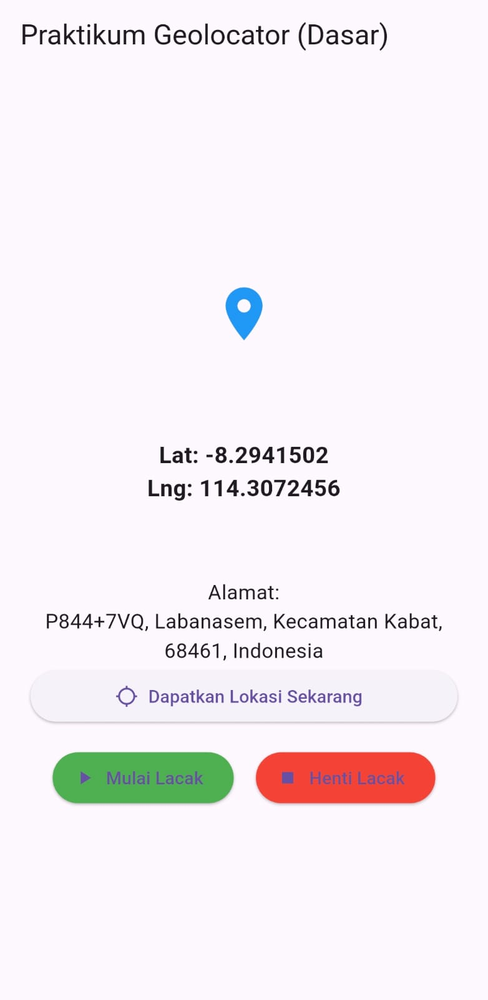

# geo_project

A. new Flutter project Geolocator .
 yang harus dilakukan adalah menambahkan dependencies pada puspec.yaml
 1.geolocator: ^14.0.2
 2. geocoding: ^4.0.0

B.Menambahkan kode di AndroidManifest.xml

## membuat praktikum sensor maps pada aplikasi mobile

1. Import paketnya: import ’package:geocoding/geocoding.dart’;

3. Buat variabel String? currentAddress; di MyHomePageState.

4. Buat fungsi baru getAddressFromLatLng(Position position).

5.  Panggil fungsi getAddressFromLatLng( currentPosition!) di dalam getLocation
dan startTracking (di dalam .listen()) setelah setState untuk currentPosition.

6. Tampilkan currentAddress di UI Anda, di bawah Lat/Lng.

Hasil project praktikum

